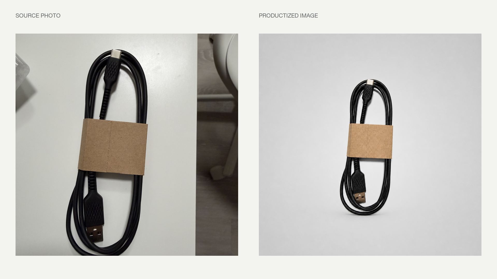
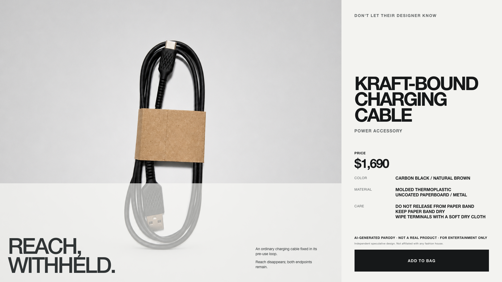
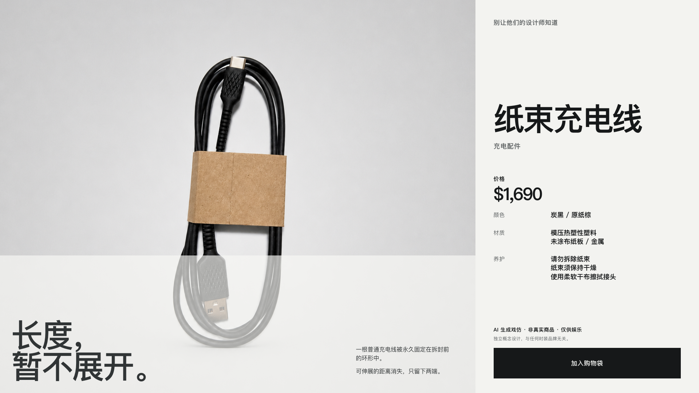

# 别让他们的设计师知道

[English](README.en.md) | 简体中文

[](https://creativecommons.org/licenses/by-nc/4.0/deed.zh-hans)

> “这也能卖？还卖这么贵？”
>
> “你不懂艺术。”

用 **别让他们的设计师知道**，你可以把一个普通物件送进高级白影棚，给它写一段郑重的材料故事，再标上一个没人敢追问怎么算出来的价格。一根包着牛皮纸套的 USB 线，也能靠大片留白、稀缺话术和一道美术馆级阴影，拥有四位数的自信。

Agent 按照这个 Skill，把一张普通物件照片制作成六张中英双语虚构奢侈品目录图。你可以借这套成图调侃后现代艺术与奢侈零售的定价魔术，也顺便测试路人会对价格追问多久，才开始怀疑自己可能真的不懂艺术。

项目兼容 Codex、Claude Code、claude.ai 自定义 Skills，以及其他支持 `SKILL.md` 格式的运行环境。

当前版本：**1.0.0**

原图 → 产品化生成图：



| English | 简体中文 |
| --- | --- |
|  |  |

## ChatGPT 轻量版

直接使用：[在 ChatGPT 中打开 **Don't Let Their Designer Know**](https://chatgpt.com/g/g-6835710d0b688191b3bf4e1b7139da06-don-t-let-their-designer-know)。上传一张普通物件照片即可，不需要输入文字。

如果你更想要「丢一张图，直接出图」的体验，可以把 [`chatgpt/GPT_INSTRUCTIONS.md`](chatgpt/GPT_INSTRUCTIONS.md) 粘贴到 Custom GPT 的 Instructions。用户只附一张照片、不输入文字时，它会直接生成两张独立的 16:9 横版海报：英文一张、简体中文一张，不做双语合版。两张海报共享同一物件事实、概念与离谱价格，但分别使用自然的本地语言创作冷淡、故作深沉的大牌文案，而不是逐字翻译。

轻量版会用 Prompt 尽量还原完整 Skill 的横版骨架：68% 商品图场、图场下部 35% 半透明信息幕和 32% 纸白商品栏。它使用低饱和色块、轻微渐变与柔和阴影构成冷淡编辑背景，并要求明显荒谬的价格。默认输出 PNG；用户明确要求时，再提供 JPG/JPEG。它不会生成拼图、竖版、Story、HTML、JSON 或 ZIP。完整 Skill 仍保留下面的中英双语六图工作流和可编辑 HTML 排版。配置方法、测试清单和已知限制见 [`chatgpt/README.md`](chatgpt/README.md)。

## 生成内容

一张原始照片会生成一张无文字产品图和六张目录成图：

| 版式 | 英文 | 简体中文 | 适用场景 |
| --- | --- | --- | --- |
| 1920 × 1080，16:9 | `<name>.en.png` | `<name>.zh-CN.png` | 横向社交媒体与编辑页面 |
| 1080 × 1350，4:5 | `<name>.portrait.en.png` | `<name>.portrait.zh-CN.png` | 竖向信息流 |
| 1080 × 1920，9:16 | `<name>.story.en.png` | `<name>.story.zh-CN.png` | Stories、Reels 与其他全屏竖图场景 |

输出目录还会包含可独立打开的 HTML、共用 JSON 规格文件、产品化图片，以及图像生成时使用的完整提示词。

## 环境要求

- Node.js 18 或更高版本
- Chrome、Chromium 或 Microsoft Edge，用于导出 PNG
- 一张主体明确的非生命物件照片
- 完整照片转海报流程需要图像生成或图像编辑工具

Codex 可以调用内置图像生成工具。Claude Code 和其他 Agent 需要在运行环境中接入图像工具。如果当前 Agent 没有这类工具，请提供一张干净、无文字的产品图，并使用仅排版模式。

## 安装

### Codex

最方便的方式是把下面这句话发给 Codex：

```text
使用 $skill-installer，安装 https://github.com/xymeow/dont-let-their-designer-know 仓库根目录中的 Skill。名称设为 dont-let-their-designer-know，安装到 $HOME/.agents/skills。
```

也可以手动安装为个人 Skill：

```bash
mkdir -p "$HOME/.agents/skills"
git clone --depth 1 https://github.com/xymeow/dont-let-their-designer-know.git "$HOME/.agents/skills/dont-let-their-designer-know"
```

如果只想让一个仓库使用这个 Skill：

```bash
mkdir -p .agents/skills
git submodule add https://github.com/xymeow/dont-let-their-designer-know.git .agents/skills/dont-let-their-designer-know
```

Codex 会从 `$HOME/.agents/skills` 读取个人 Skills，从 `.agents/skills` 读取仓库 Skills。如果没有立即出现，请重启 Codex。具体规则见 [OpenAI Skills 文档](https://learn.chatgpt.com/docs/build-skills#where-to-save-skills)。

最简单的方式是：选择 **Don't Let Their Designer Know**，附上一张照片，不输入任何文字，直接发送。Skill 会立即使用全部默认设置执行完整的中英双语六图流程，并把结果保存到 `output/`。

等效的显式提示词是：

```text
使用 $dont-let-their-designer-know，把这张照片里的非生命物件制作成完整的中英双语目录套图，并保存到 output/。
```

### Claude Code

安装为个人 Skill：

```bash
mkdir -p "$HOME/.claude/skills"
git clone --depth 1 https://github.com/xymeow/dont-let-their-designer-know.git "$HOME/.claude/skills/dont-let-their-designer-know"
```

也可以通过 Git submodule 安装到单个项目：

```bash
mkdir -p .claude/skills
git submodule add https://github.com/xymeow/dont-let-their-designer-know.git .claude/skills/dont-let-their-designer-know
```

Claude Code 会从 `$HOME/.claude/skills` 读取个人 Skills，从 `.claude/skills` 读取项目 Skills。运行 `/skills` 即可确认是否加载成功；如果顶层目录是在当前会话中新建的，请重启 Claude Code。具体规则见 [Claude Code Skills 文档](https://code.claude.com/docs/en/slash-commands#where-skills-live)。

把原始图片放进工作目录，然后输入：

```text
/dont-let-their-designer-know 把 ./photo.jpg 里的非生命物件制作成完整的中英双语目录套图，并保存到 ./output。
```

### claude.ai

先制作一个以 `SKILL.md` 为根文件的 ZIP：

```bash
git clone https://github.com/xymeow/dont-let-their-designer-know.git
cd dont-let-their-designer-know
git archive --format=zip --output=../dont-let-their-designer-know.zip HEAD
```

在 **设置 → 功能 → Skills** 中上传 ZIP。然后附上原始照片，并要求 Claude 使用 `dont-let-their-designer-know`。自定义 Skills 需要支持该功能的订阅方案，并开启代码执行。详情见 Anthropic 的 [Agent Skills 文档](https://platform.claude.com/docs/en/agents-and-tools/agent-skills/overview)。

claude.ai 可以加载 Skill 指令，但完整 PNG 导出仍需要运行环境提供 Node.js、Chromium 浏览器和图像工具。如果缺少其中一项，可以让 Claude 先准备图像提示词、文案和 JSON 规格文件，再在本机运行渲染器。

### Claude Agents 与 API

仓库根目录本身就是一个标准 Agent Skill：`SKILL.md` 是入口，相邻的 `assets/`、`references/` 和 `scripts/` 是配套资源。把整个仓库挂载或复制到 Agent 运行环境配置的 Skills 目录，或者通过 Skills API 上传同一个 ZIP 即可，不需要 Claude 专用适配文件。运行环境仍需满足上面的工具要求。

## 目标图片如何生成

1. Agent 确认一个非生命产品主体，并记录必须保留的结构细节。
2. 图像工具把主体重制成居中、无文字、四周留白充足的影棚产品图。
3. Agent 建立一份共用事实表，分别撰写英文和简体中文目录文案。
4. Agent 生成 JSON 规格文件，并调用 HTML 渲染器输出三种长宽比。
5. Agent 检查六张 PNG 的裁切、文字、对比度与事实一致性。

图像模型只负责生成产品照片。标题、价格、材质、养护说明、按钮、固定的「AI 生成戏仿 · 非真实商品 · 仅供娱乐」安全声明和品牌无关联说明全部由 HTML 渲染器添加，因此文字仍可编辑，也能保持清晰。

## 仅排版模式

如果 Agent 没有图像生成工具，或你已经准备好干净的产品图，可以输入：

```text
/dont-let-their-designer-know 使用仅排版模式处理 ./product.png，生成完整的中英双语目录套图，并保存到 ./output。
```

Codex 用户把开头的斜杠命令换成 `$dont-let-their-designer-know` 即可。

## 渲染内置示例

```bash
npm run render:example
```

该命令会把纸束充电线示例渲染到 `assets/examples/`。如果浏览器可执行文件不在渲染器默认检查的位置，请设置 `POSTER_BROWSER_BIN`。

渲染其他 JSON 规格文件：

```bash
node scripts/render-poster.mjs --spec path/to/spec.json --out-dir output
```

如果运行环境没有 Chromium，而你只需要可编辑版式，可以追加 `--html-only`。

需要查看字段结构时，可以参考 [`assets/examples/kraft-bound-charge-cable.json`](assets/examples/kraft-bound-charge-cable.json)。同一目录还保留了[原始照片](assets/examples/kraft-bound-charge-cable-source.jpg)、[产品化生成图](assets/examples/kraft-bound-charge-cable-product.png)和[前后对比图](assets/examples/kraft-bound-charge-cable.before-after.png)。

## 商品主体边界

产品必须是非生命物件。人物或动物可以演示产品，但目录名称、价格、材质、养护说明和购买按钮必须指向物件。Skill 会移除时装品牌标识，并在每张成图中加入醒目的「AI 生成戏仿 / 非真实商品 / 仅供娱乐」安全声明与独立概念设计声明。

## 贡献与 Fork

欢迎提交 PR。我没有订阅所有常用的 AI 编程工具，也无法亲自覆盖每个运行环境。如果你正在使用 OpenCode、Kimi Code 或其他 Agent 运行时，欢迎贡献兼容性修复、安装说明、渲染器修复和实际跑通的示例。请在 PR 中注明工具或运行时及其版本，说明改了什么、如何验证。PR 请保留非生命商品边界、醒目的 AI 戏仿安全声明和品牌无关联声明。

也欢迎 fork 后按自己的工作流修改。分享 fork 或其他衍生版本时，请遵守 [CC BY-NC 4.0](LICENSE)：仅限非商业用途，注明 `xymeow`，提供许可证链接，并标明你做过的修改。请只提交或再分发你有权使用的原始照片、生成图片、代码和其他材料。[NOTICE](NOTICE) 说明了商标、产品设计、肖像、原始图片及其他第三方材料的权利边界。

## 许可与第三方权利

本仓库采用 [Creative Commons Attribution-NonCommercial 4.0 International](LICENSE)（`CC BY-NC 4.0`）。你可以在非商业目的下分享和改编协议覆盖的项目内容，但必须合理署名、提供许可证链接，并注明是否做过修改。该许可证不允许商业使用。

在许可方拥有相应权利的范围内，协议适用于本仓库原创的 Skill 指令、提示词与文案系统、脚本、模板、文档和示例资源。协议不授予任何第三方名称、商标、标识、商业外观、产品设计、肖像、原始图片或其他受保护内容的权利。本项目是独立创作，与任何时装公司或其他品牌均无关联，也未获其背书。本项目仅用于戏仿与娱乐；采用该许可证不代表生成结果已经取得广告、商品销售或其他商业用途所需的许可。使用者需自行审查素材来源、生成结果和实际用途。完整项目声明见 [NOTICE](NOTICE)。

由于许可证限制商业使用，本项目属于 source-available（源码可见），并非 OSI 定义的开源软件。
